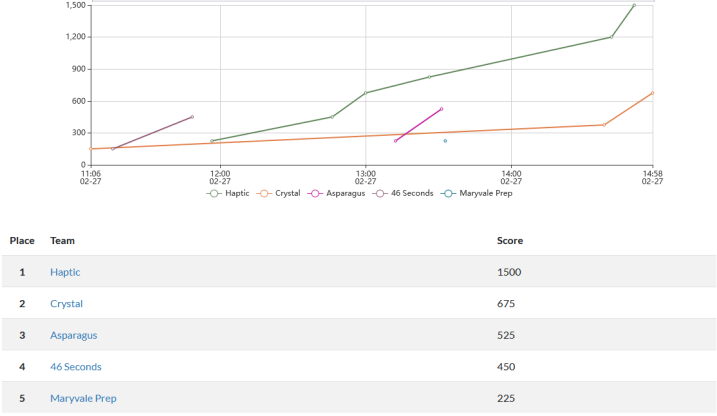

# HS
These are the CHCTF high school challenges. Included in each folder are
the flavor text for the challenge, a write-up for the challenge, and all the
source code and random configuration for for the challenge.

# Score Breakdown for HS
| No. 	| Team (School)         	| CTF Challenge Score 	| Attack/Defense Uptime Score 	| Total Score 	|
|-----	|-----------------------	|---------------------	|-----------------------------	|-------------	|
| 1.  	| Crystal (LB)          	| 675                 	| 2430                        	| 3105        	|
| 2.  	| 46 Seconds (CHC)      	| 450                 	| 1710                        	| 2160        	|
| 3.  	| Haptic (LB)           	| 1500                	| 300                         	| 1800        	|
| 4.  	| Asparagus (JC)        	| 525                 	| 770                         	| 1295        	|
| 5.  	| Maryvale Prep         	| 225                 	| 1020                        	| 1245        	|
| 6.  	| Cyber Blazers 1 (NDP) 	| 0                   	| 870                         	| 870         	|
| 7.  	| Cyber Blazers 2 (NDP) 	| 0                   	| 70                          	| 70          	|
| 7.  	| Cyberhawks (CHC)      	| 0                   	| 70                          	| 70          	|

# Graphs!

