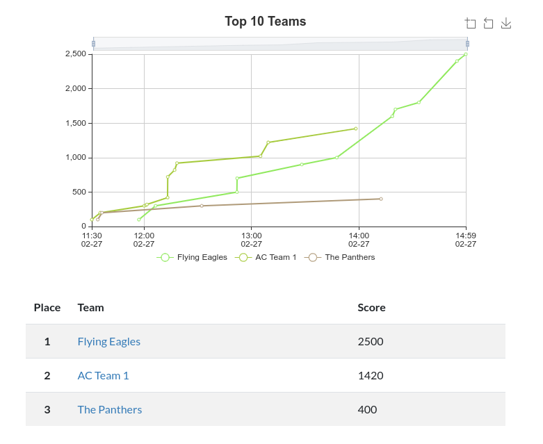

# MS
These are the CHCTF middle school challenges. Included in each folder are
the flavor text for the challenge, a write-up for the challenge, and all the
source code and random configuration for for the challenge.

# Score Breakdown for MS
| No. 	| Team (School)       	| CTF Challenge Score 	|
|-----	|---------------------	|---------------------	|
| 1.  	| Flying Eagles (IHM) 	| 2500                	|
| 2.  	| AC Team 1 (SPX)     	| 1420                	|
| 3.  	| The Panthers (SPX)  	| 400                 	|

# Graphs!

